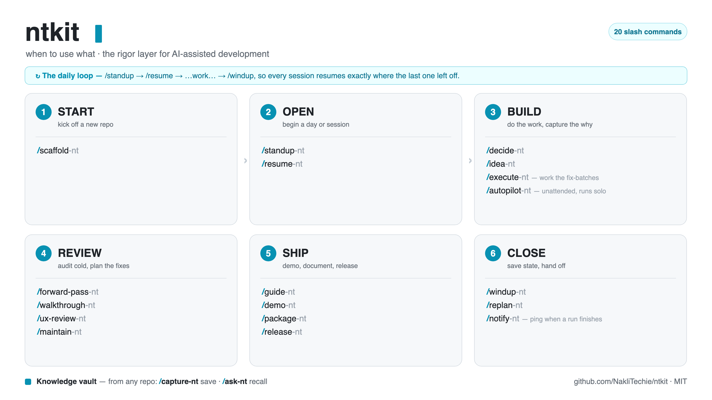

# ntkit

**The rigor layer for AI-assisted development.**

Coding agents are great at writing code and bad at everything around it — remembering what you decided last week, picking a project back up mid-thought, auditing the *whole* app instead of just the diff, shipping without leaking a secret. `ntkit` is twenty [Claude Code](https://docs.claude.com/en/docs/claude-code) slash commands that add that operational discipline — the opposite of vibe coding — across as many repos as you run at once.

<p align="center">
  
</p>

Most share one idea: a **gitignored `plan/` folder** in each repo holding three files —

- `history.md` — Decisions · Log · Dead ends
- `pending.md` — Now · Parked · Open questions
- `workplan.md` — chunked, checkboxed play

The commands read and write those files, so every session picks up exactly where the last one left off. A separate pair — `/capture-nt` and `/ask-nt` — works the other side of the desk: a personal **knowledge vault** you capture into and ask questions of (see [below](#knowledge-vault)).

> The `-nt` suffix is just the namespace (NakliTechie) — it keeps these from colliding with your own commands. Rename freely.

| Command | When | What it does |
|---------|------|--------------|
| `/scaffold-nt` | new project | Bootstrap from attached handoff materials (md/zip): local folder + git + remote repo + seeded `plan/` + a brief on the first move. |
| `/standup-nt` | start of day | Scan every repo with a `plan/` folder → active / idle / stale, each with its **state** + next move; flags inconsistent repos and unreviewed autopilot runs. Pick one. |
| `/resume-nt` | start of session | Read the handoff (workplan + pending + history + latest summary + git state), name the repo's **state** and its legal next moves, flag anything that doesn't add up, and wait — or `/resume-nt go` to start the top chunk straight off a clean brief. Read-only. |
| `/decide-nt "<why>"` | mid-session | Append a dated one-line decision to `history.md`. Captures the *why* before it evaporates. |
| `/idea-nt "<idea>"` | anytime | Park a future-work idea into the backlog (`plan/ideas.md`, or `IDEAS.md` if present) — the `/decide-nt` pattern, for ideas. Friction-free, no derailing the current task. |
| `/forward-pass-nt` | anytime | Fresh-eyes whole-app audit — bugs / security / stray code — that outputs a **batched workplan**, not a findings dump; `fix` flows straight into executing the keystone batch. Writes `plan/forward-pass-<date>.md`. |
| `/walkthrough-nt` | anytime | Live counterpart to `/forward-pass-nt`: identify each user role, drive the running app through their journeys **in a real browser**, catch logical errors as they surface, and **fix them** — then leave a committed, rerunnable **verification harness** that becomes the project's verifier (the `/release-nt` and `/autopilot-nt` gates run it). Writes `plan/walkthrough-<date>.md`. |
| `/guide-nt` | anytime | Documentation sibling of `/walkthrough-nt`: walk each role's features **in a browser capturing screenshots**, then build a single-file **searchable HTML guide**. Regenerates from a committed generator — never hand-edits the output. |
| `/demo-nt` | live demo | Presenter mode for showing WIP to customers/execs — boot the app with the **shared demo seed** (the same asset `/walkthrough-nt` + `/guide-nt` use) and open an interactive **explorer** (features · connections · deps, drill-down + inline search), then hand you clickable links to both the live app and the explorer. |
| `/ux-review-nt` | anytime | Cold-first-timer UX review: wipe all state, walk the app **as a brand-new user**, and report where build-order accretion fails the newcomer (arrival, onboarding, nav/IA) — plus a Lighthouse a11y + perf pass. Read-only; proposes an ideal first-run + IA. Writes `plan/ux-review-<date>.md`. |
| `/execute-nt` | anytime | Work a batched fix-workplan from a `/forward-pass-nt` / `/ux-review-nt` / `/maintain-nt` report — fix + verify + **commit** each item, check it off with a **what · evidence · result** progress row (SHA / `file:line` / check output — pointers that resolve, not prose), and roll batch to batch, pausing only on **red flags** (a test-file change, owed verification, a systemic failure). Refuses to run without an open plan. The **executor** for static findings. |
| `/autopilot-nt` | away | Unattended executor — run the plan while you're in a meeting or asleep, **in its own git worktree** (branch `autopilot/<date>`). Inverts `/execute-nt`'s pause-at-boundaries: it **keeps going**, verifies each item with a **fresh-eyes subagent**, commits continuously, **parks** anything needing a human call or crossing a stop-line (no publish / send / delete / money), runs a **final whole-project gate**, then **ships a green run** — merges to the default branch and pushes — or **holds a red one** on the branch for review, and leaves a **morning report** — audited against the git trail before it's written — that `/resume-nt` reads. |
| `/notify-nt` | after a run | Completion ping — desktop notification + optional phone push (ntfy.sh topic). `/autopilot-nt` fires it when a run finishes; degrades silently if unconfigured. |
| `/maintain-nt` | upkeep | Maintenance sweep — outdated/deprecated deps, stale GitHub Actions, security advisories, dead links, lockfile drift → a ranked fix-workplan. **Applies safe quick-fixes automatically** (verified, reverted on failure); majors defer to `/execute-nt`. Writes `plan/maintenance-<date>.md`. |
| `/release-nt` | launch | Cut a release — suggest a semver bump from the commits, write `CHANGELOG.md`, draft notes, then on confirm tag + push + GitHub release + deploy. **Guarded:** refuses over a red verifier, an open fix-workplan, or a HELD autopilot branch (override only via a logged `/decide-nt`). The mechanics, where `/package-nt` is the marketing. |
| `/package-nt` | launch | Ship a project to the world — the bookend to `/scaffold-nt`: a deep readiness gate (`/security-review` + `/forward-pass-nt` + a secrets + essentials check), social-framed screenshots (committed to `marketing/`), and drafted X / LinkedIn / Show HN / subreddit collateral (local). **Drafts, never posts.** |
| `/windup-nt` | end of session | Day summary + pending + workplan + push + tomorrow's handoff. Honest about the closing state — a mid-chunk close gets named, never papered over. |
| `/replan-nt` | occasionally | Fold accumulated summaries + scratch back into the three files; archive the rest. Runs the **replay check** first — history replayed against pending, orphans and ghosts reported before anything is archived. |

They speak one vocabulary, so each hands off to the next: `/windup-nt` writes what `/resume-nt` reads, `/forward-pass-nt` and `/walkthrough-nt` feed `/replan-nt`, `/decide-nt` feeds `history.md`.

## The state machine

That vocabulary was always secretly a state machine — `plan/` is the external state, the commands are events, windup→resume is a transition. [`STATES.md`](STATES.md) makes it explicit: six session states (`fresh → briefed → building → verifying → blocked / shipped`), which commands are legal from which, and the guards that enforce it. Four rules do the enforcing:

- **Every command declares its contract in frontmatter** — `entry` (what it requires), `exit` (the machine-checkable condition that means it finished), `writes` (which plan files it touches). A command whose entry fails refuses; it doesn't proceed politely. `/release-nt` won't tag over a failing verifier or an open fix-workplan; `/execute-nt` won't invent a plan when none exists.
- **"Done" is the verifier's word**, never the agent's — no state advances on a self-report.
- **Overrides are deliberate and logged** — any guard yields to an explicit `/decide-nt` entry stating why. Bypassed on purpose with a reason is a decision; bypassed by drift is a bug.
- **Asks are reserved for the unanswerable and the outward-facing** — missing input, unknown credentials, publish/post/release. Everything else takes the safe default, announces it, and logs it; you steer by interrupting, not by being polled.

Parallel `/autopilot-nt` runs follow the actor rule: each in its own worktree, no shared state, the morning report as the only mailbox, `/standup-nt` the sole cross-repo reader. And `history.md` is an event log — `/replan-nt` replays it against `pending.md` and reports drift before archiving anything. No framework, no dependency: the formalism is a markdown table and three frontmatter lines.

## Knowledge vault

Two commands operate on a single Obsidian-compatible **knowledge vault** (plain-markdown, git-backed) instead of a repo's `plan/` folder — the write and read halves of a second brain. They keep one rule: **sources** (what *they* said) stay separate from **notes** (what *you* concluded).

| Command | When | What it does |
|---------|------|--------------|
| `/capture-nt <url\|file>` | save something | Fetch + extract a URL / file / PDF (full text, OCR for scans), **follow & fully index any referenced repo or arXiv paper**, write a schema'd **source note**, tag its realm (knowledge / personal / work), link it into the right topic map with backlinks, and optionally promote a distilled **note** — then commit + push. Idempotent on re-run. |
| `/ask-nt <question>` | recall something | Search + read the vault and answer **grounded only in your own notes**, with citations to the notes used. The read-side sibling of `/capture-nt` — the "search" half of your personal Google. Read-only. |

Both expect a vault at `~/Code/knowledge` (edit that path at the top of `commands/capture-nt.md` and `commands/ask-nt.md` if yours lives elsewhere).

## Install

```bash
git clone https://github.com/NakliTechie/ntkit
cp ntkit/commands/*.md ~/.claude/commands/                 # available in all projects
# or:  cp ntkit/commands/*.md <project>/.claude/commands/  # just one project
```

The command name is the filename without `.md` (`windup-nt.md` → `/windup-nt`). First run will offer to add `plan/` to your `.gitignore`. If you don't keep repos under `~/Code`, set your scan root at the top of `commands/standup-nt.md`.

## Scheduling — the heartbeat

Every command above waits for you to type it. Two are built to run without you — the loop-engineering half of the kit: stop being the person who prompts the agent, design the system that does.

- **`/maintain-nt` weekly** — rot detection is recurring and deterministically checkable: ideal cron work. Findings land in `plan/`; `/standup-nt` surfaces them.
- **`/autopilot-nt` nightly** — it already handles the no-human case (skips the launch contract, takes the safest scope: top batch, default budget, nothing destructive), and the worktree isolation + stop-lines + final gate are precisely what make an unattended run safe. A green gate ships itself to the default branch; a red one waits on its branch — so a scheduled run lands passing work by morning and never merges a failure.

Claude Code runs headless with `-p` — custom slash commands expand inside the prompt string — and an unattended run needs a permission mode, or it hangs waiting for an approval nobody is there to give:

```cron
# Monday 07:00 — maintenance sweep; findings land in plan/
0 7 * * 1  cd ~/code/myproject && timeout 30m claude -p "/maintain-nt" --dangerously-skip-permissions >> ~/.ntkit-cron.log 2>&1

# Nightly 02:00 — work the top batch on an autopilot branch
0 2 * * *  cd ~/code/myproject && timeout 6h claude -p "/autopilot-nt" --dangerously-skip-permissions >> ~/.ntkit-cron.log 2>&1
```

(macOS: `launchd` if you prefer; cron works. Cron doesn't load your shell profile — make sure `claude` is on cron's `PATH` and auth is available non-interactively, e.g. via `claude setup-token`.)

Three honest notes. **`--dangerously-skip-permissions` is exactly what it says** — the command's own guardrails replace the prompts, so schedule only commands that carry their own: `/maintain-nt` is read-only by contract; `/autopilot-nt` parks anything irreversible, and the only outward action it will take is merging a **gate-green** run to the default branch and pushing it — a red run never merges. Tighter fences exist (`--allowedTools`, `--max-turns`, `--max-budget-usd`) — use them where they fit. **The `timeout` wrapper is the outer budget** — a stuck agent runs until something kills it. And **a scheduled run still ends at a human**: the morning report says what shipped and what's held, and `/resume-nt` reads it straight into your next session. The loop finds, does, and lands the safe work; you review what it couldn't.

## The one to try first

`/forward-pass-nt`. Every other review tool looks at your diff; this one reads the whole app cold and hands back an ordered, checkboxed fix-plan with stable finding IDs — the kind of thing you actually work through instead of skim once.

## The name

`nt` is the namespace every command carries — that `-nt` suffix — short for **NakliTechie**. `kit` is what it is. It started life as a pile of one-off prompts in [NakliTechie/prompts](https://github.com/NakliTechie/prompts), grew into a `claude-code-commands/` folder, and spun out into its own repo in June 2026.

## NakliTechie

*Nakli* (नकली) is Hindi for "fake" or "imitation" — so **NakliTechie**, the cheerfully self-appointed *fake techie*, is the maker handle of **[Chirag Patnaik](http://www.chiragpatnaik.com)** (Bombay — two decades across media, technology, marketing and politics, none of it formally "engineering"). The 80-plus public repos rather give the game away: mostly **single-file web apps that run entirely in your browser — no accounts, no servers, no data leaving your device** (house tagline: *"all these tools, none of your data"*). The current research focus is newer and heavier: **small-language-model training and distributed inference** — getting capable models to fine-tune and serve on the hardware you actually have.

ntkit sits closer to that second thread than the first — a coding-agent toolkit, not a browser app — but it keeps the same ethos: local-first, sovereign, no lock-in.

**Wander in:**
- 🖥️ **[NakliOS](https://naklios.dev/)** — a whole desktop in your browser; the hub for 40+ of the apps
- 🗂️ **[All projects](https://naklitechie.github.io/)**  ·  **[github.com/NakliTechie](https://github.com/NakliTechie)**
- ✍️ **[chiragpatnaik.com](http://www.chiragpatnaik.com)**  ·  **[naklitechie.com](https://naklitechie.com)**  ·  **[Substack](https://naklitechie.substack.com/)**

A few siblings an ntkit user might like: **[LocalMind](https://naklitechie.github.io/LocalMind/)** (private AI research agent), **[VaultMind](https://vaultmind.naklitechie.com/)** (an Obsidian-vault explorer — a natural front-end for what `/capture-nt` writes), and **[Private Mesh](https://github.com/NakliTechie/private-mesh)** (the sovereign capability fabric under NakliOS).

## License

MIT © Chirag Patnaik. See [LICENSE](LICENSE).
