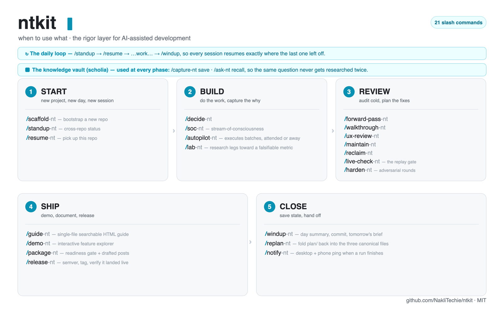

# ntkit

**The rigor layer for AI-assisted development.**

Coding agents write code well. They're bad at everything around it: remembering decisions, picking up mid-thought, auditing the whole app instead of just the diff, reporting "done" when nothing verified it.

`ntkit` is twenty-one [Claude Code](https://docs.claude.com/en/docs/claude-code) slash commands that add that discipline, across every repo you run.

<p align="center">
  
</p>

## The convention

Most commands share one idea: a gitignored `plan/` folder per repo, three files.

- `history.md` — Decisions · Log · Dead ends
- `pending.md` — Now · Parked · Open questions
- `workplan.md` — chunked, checkboxed work

Commands read and write those files. Every session picks up where the last one left off.

> `-nt` is just the namespace (NakliTechie), so these don't collide with your own commands. Rename freely.

## Commands

| Command | When | What it does |
|---------|------|--------------|
| `/scaffold-nt` | new project | Bootstrap from a handoff: folder + git + remote + seeded `plan/` + first-move brief. |
| `/standup-nt` | start of day | Scan every repo with `plan/` — active / idle / stale, next move for each. |
| `/resume-nt` | start of session | Read the handoff, name the repo's state, wait — or `go` to start the top chunk. Read-only. |
| `/decide-nt "<why>"` | mid-session | Append a dated one-line decision to `history.md`. |
| `/soc-nt "<thought>"` | mid-build | Raw stream-of-consciousness into `plan/soc.md`. `/replan-nt` triages it later. |
| `/forward-pass-nt` | anytime | Fresh-eyes whole-app audit → a batched, checkboxed fix-workplan. |
| `/walkthrough-nt` | anytime | Drive each role's journeys in a real browser, fix bugs as found, leave a rerunnable verification harness. |
| `/guide-nt` | anytime | Walk each role's features in a browser, build a single-file searchable HTML guide. |
| `/demo-nt` | live demo | Boot the app on the shared demo seed, open an interactive feature explorer. |
| `/ux-review-nt` | anytime | Cold-first-timer review: wipe state, walk it as a new user, rank onboarding/nav failures + a11y/perf. |
| `/live-check-nt` | verifying → shipped | Drive the real deployed runtime with a real gesture; machine evidence it actually works. |
| `/autopilot-nt` | anytime | The executor — works a fix-workplan or goal to completion, unattended, in its own worktree. Ships green, holds red. |
| `/lab-nt` | research | The discoverer — shapes an idea into a falsifiable contract, runs bounded experiment legs, journals every attempt. |
| `/notify-nt` | after a run | Desktop notification + optional phone push. |
| `/maintain-nt` | upkeep | Stale deps / Actions / advisories / dead links → a ranked fix-workplan; safe fixes applied automatically. |
| `/release-nt` | launch | Semver bump, CHANGELOG, tag, push, GitHub release, verify the deploy landed live. |
| `/package-nt` | launch | Ship-readiness gate, marketing screenshots, drafted launch posts. Drafts, never posts. |
| `/windup-nt` | end of session | Day summary, pending, commit/push, tomorrow's handoff. |
| `/replan-nt` | occasionally | Fold accumulated files back into the three canonical ones; archive the rest. |

They hand off in sequence: `/windup-nt` writes what `/resume-nt` reads; `/forward-pass-nt` and `/walkthrough-nt` feed `/replan-nt`; `/soc-nt` feeds `/replan-nt`'s triage.

## The state machine

`plan/` is state. Commands are events. [`STATES.md`](STATES.md) names six session states (`fresh → briefed → building → verifying → blocked / shipped`) and which commands are legal from which.

Four rules enforce it:

- **Every command declares its contract** — `entry`, `exit`, `writes` in frontmatter. A failed entry refuses, it doesn't proceed politely. See [`AUTHORING.md`](AUTHORING.md).
- **"Done" is the verifier's word**, never the agent's.
- **Overrides are logged**, via `/decide-nt`. Bypassed on purpose is a decision; bypassed by drift is a bug.
- **Asks are reserved for the unanswerable.** Everything else takes the safe default and logs it.

## The report format

[`ATTEST.md`](ATTEST.md) governs how agents talk to you. Typed blocks — RESULT / STATUS / BLOCKER / QUESTION / RISK / DIFF / PLAN / ESCALATION — worst news first. Every claim carries an evidence class: `verified`, `observed`, `inferred`, `assumed`, `reported`. Words like *done* or *works* are locked to `verified` claims with a resolving pointer. No hedges, no minimizers, no success theater.

## Built for the driver

[`DRIVER.md`](DRIVER.md) governs what these commands *build*: everything ships agent-ready. A design pass — [@doodlestein](https://x.com/doodlestein)'s [prompt](https://x.com/doodlestein/status/2094288037458882668), used in toto (his agentic-development work: [github.com/Dicklesworthstone](https://github.com/Dicklesworthstone)) — run once a first spec exists; `/scaffold-nt` seeds it into every new workplan.

Ten principles: one perception act, machine-decidable outputs, one verdict per next action, bounded output, failures that name their remedy, crash-safety, the tool holding the memory, accretion by mechanism, a tower of abstractions, a fail-closed evaluator outside the loop.

## What counts as progress

[`SUBSTANCE.md`](SUBSTANCE.md) says what counts as delivered. No process theater — an artifact earns its place only as a real gate. Most open items must deliver runnable behavior. Never fake a test or close undone work. A refusal is honest but never counts as delivery.

## Knowledge vault

Two commands work a personal knowledge vault instead of a repo's `plan/` — plain-markdown, git-backed. One rule: sources (what *they* said) stay separate from notes (what *you* concluded).

| Command | When | What it does |
|---------|------|--------------|
| `/capture-nt <url\|file>` | save something | Fetch, extract, write a schema'd source note, link it into a topic map, commit + push. |
| `/ask-nt <question>` | recall something | Search the vault, answer grounded only in your notes, with citations. Read-only. |

Both expect a vault at `~/Code/knowledge` — edit the path in `commands/capture-nt.md` and `ask-nt.md` if yours differs.

## Install

```bash
git clone https://github.com/NakliTechie/ntkit
cp ntkit/commands/*.md ~/.claude/commands/                 # all projects
# or:  cp ntkit/commands/*.md <project>/.claude/commands/  # one project
```

Command name = filename without `.md` (`windup-nt.md` → `/windup-nt`). First run offers to gitignore `plan/`. Set your scan root at the top of `commands/standup-nt.md` if you don't keep repos under `~/Code`.

## Scheduling

Two commands run without you.

- **`/maintain-nt` weekly** — read-only rot detection, ideal cron work.
- **`/autopilot-nt` nightly** — worktree-isolated, ships a green gate to main, holds a red one on its branch.

```cron
0 7 * * 1  cd ~/code/myproject && timeout 30m claude -p "/maintain-nt" --dangerously-skip-permissions >> ~/.ntkit-cron.log 2>&1
0 2 * * *  cd ~/code/myproject && timeout 6h claude -p "/autopilot-nt" --dangerously-skip-permissions >> ~/.ntkit-cron.log 2>&1
```

`--dangerously-skip-permissions` is exactly what it says — only schedule commands with their own guardrails. `timeout` is the outer budget. A scheduled run still ends at a human: the morning report is what `/resume-nt` reads next.

## The one to try first

`/forward-pass-nt`. Reads the whole app cold, hands back an ordered fix-plan with stable finding IDs — the kind of thing you actually work through.

## The name

`nt` = NakliTechie, `kit` = what it is. Started as one-off prompts in [NakliTechie/prompts](https://github.com/NakliTechie/prompts), spun out into its own repo in June 2026.

## NakliTechie

*Nakli* (नकली) is Hindi for "fake" — **NakliTechie** is the maker handle of **[Chirag Patnaik](http://www.chiragpatnaik.com)**. Mostly single-file browser apps, no accounts, no servers, no data leaving your device. Current focus: small-language-model training and distributed inference.

- 🖥️ **[NakliOS](https://naklios.dev/)** — a whole desktop in your browser
- 🗂️ **[All projects](https://naklitechie.github.io/)** · **[github.com/NakliTechie](https://github.com/NakliTechie)**
- ✍️ **[chiragpatnaik.com](http://www.chiragpatnaik.com)** · **[naklitechie.com](https://naklitechie.com)** · **[Substack](https://naklitechie.substack.com/)**

Siblings worth a look: **[LocalMind](https://naklitechie.github.io/LocalMind/)**, **[VaultMind](https://vaultmind.naklitechie.com/)**, **[Private Mesh](https://github.com/NakliTechie/private-mesh)**.

## License

MIT © Chirag Patnaik. See [LICENSE](LICENSE).
