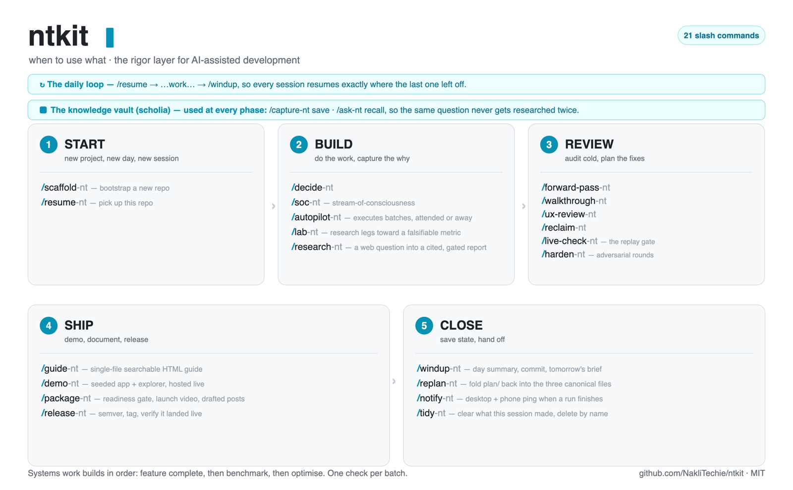

<h1 align="center">ntkit</h1>

<p align="center">
  <strong>Twenty-one Claude Code skills that give an agent the discipline it is missing: it keeps its decisions, audits the whole app, and reports "done" only behind a verifier.</strong>
</p>

<p align="center">
  Plain markdown. No account, no server, no config file.
</p>

<p align="center">
  <a href="../../releases/latest"></a>
  <a href="LICENSE"></a>
  
  
</p>



## Install

| | |
|---|---|
| **All your projects** | `cp -r ntkit/skills/* ~/.claude/skills/` |
| **One project** | `cp -r ntkit/skills/* <project>/.claude/skills/` |

```bash
git clone https://github.com/NakliTechie/ntkit && cd ntkit
cp -r skills/* ~/.claude/skills/
```

The folder name is the command name: `skills/forward-pass-nt/` becomes `/forward-pass-nt`. The next Claude Code session in any repo sees every command. Run `/forward-pass-nt` first, on the repo you are in. It is read-only and writes nothing until you ask. No config file, no account, no restart.

## Why

Your agent forgets what it decided yesterday. It reviews the diff and never the app around it. It calls a fix "done" when nothing ran to check, and it starts cold every session because nothing wrote down where the last one stopped. When it does run checks, it can run them for hours and leave hundreds of thousands of test files behind, with no feature built.

ntkit adds the missing discipline. A `plan/` folder in each repo holds the decisions and the work. A cold whole-app audit returns a fix-workplan. A report format rejects "done" without a verifier behind it. Verification runs once per finished batch, into a capped temp directory, and `/tidy-nt` clears what a session made.

For systems work (engines, servers, runtimes, kernels) the build order is fixed: feature complete, then benchmark, then optimise. [SUBSTANCE.md](SUBSTANCE.md) states the rules.

**Use a single `CLAUDE.md`** if one file of standing instructions is your whole project. **Use [pi-workflows](https://github.com/osolmaz/pi-workflows)** for the six-point authoring standard alone; [`AUTHORING.md`](AUTHORING.md) borrows its shape. **Use your agent's own memory** if you need continuity inside one session only.

## Pick up where you stopped

Each repo keeps a gitignored `plan/` folder with three files: `history.md` (decisions, log, dead ends), `pending.md` (now, parked, open questions) and `workplan.md` (chunked, checkboxed work). Set `NT_PLAN_STORE` to keep every plan in one backed-up folder ([MEMORY.md §0](MEMORY.md#0-where-plan-lives)). `/windup-nt` writes them at the end of a session. `/resume-nt` reads them at the start and names the state.

`-nt` is a namespace (NakliTechie) so the commands do not collide with yours. Rename freely.

## Run it unattended

`/autopilot-nt` works a workplan overnight in its own worktree. It merges a green gate to main and holds a red one on its own branch.

```cron
0 2 * * *  cd ~/code/myproject && timeout 6h claude -p "/autopilot-nt" --dangerously-skip-permissions >> ~/.ntkit-cron.log 2>&1
```

`--dangerously-skip-permissions` does what it says, so schedule only commands that carry their own guardrails. The morning report is what `/resume-nt` reads.

## Commands

```
/scaffold-nt            # new project: folder, git, remote, seeded plan/, verification budget
/resume-nt              # start of session: read the handoff, name the state, wait or go
/decide-nt "<why>"      # mid-session: append a dated one-line decision
/soc-nt "<thought>"     # mid-build: raw thought; /replan-nt triages it later
/autopilot-nt           # anytime: work a workplan or goal, unattended, in its own worktree
/lab-nt                 # research: shape an idea into a falsifiable contract, run bounded legs
/research-nt "<q>"      # research: a web question into a cited report, stops for plan approval
/forward-pass-nt        # anytime: fresh-eyes whole-app audit, batched fix-workplan
/walkthrough-nt         # anytime: drive each role in a real browser, fix bugs, leave a harness
/ux-review-nt           # anytime: cold first-timer review, ranked onboarding and nav failures
/reclaim-nt             # upkeep: find the GB in old weights, worktrees, archives; Trash only on apply
/tidy-nt                # upkeep: clear what this session created; lists first, deletes by name
/live-check-nt          # verifying to shipped: the real deployed runtime, machine evidence
/harden-nt              # before "ready": map a surface's paths, harden each in rounds
/guide-nt               # anytime: walk each role, build a single-file searchable HTML guide
/demo-nt                # live demo: seeded app and explorer; host=<name> serves it via a tunnel
/package-nt             # launch: readiness gate, screenshots, launch video, drafted posts
/release-nt             # launch: semver, CHANGELOG, tag, push, verify the deploy live
/windup-nt              # end of session: day summary, pending, commit and push, tomorrow's handoff
/replan-nt              # occasionally: fold accumulated files back into the three canonical ones
/notify-nt              # after a run: desktop notification and optional phone push
```

The knowledge vault is a separate tool, [scholia](https://github.com/NakliTechie/scholia): `/capture-nt <url|file>` saves a source and `/ask-nt <question>` answers only from the vault, with citations. `/research-nt`, `/lab-nt` and `/scaffold-nt` check it before the web. Without scholia they search the web and nothing else breaks.

## Verify it yourself

```bash
for f in skills/*/SKILL.md; do
  for k in description entry exit writes; do
    grep -q "^$k:" "$f" || echo "missing $k: $f"
  done
done
tests/run.sh    # free, seconds: the scripts skills ship, and every eval check can fail
evals/run.sh    # model runs: a fixture project, one prompt, a deterministic check
```

Every skill states its contract in frontmatter (`entry`, `exit`, `writes`), so a run that cannot satisfy `entry` refuses, and `exit` names a check. The loop prints nothing when all 21 hold; [`AUTHORING.md`](AUTHORING.md) is the standard. A `/research-nt` report counts as verified only when `check.py gates` exits 0. `evals/run.sh` needs one login first: `CLAUDE_CONFIG_DIR=~/.ntkit-eval claude auth login` ([AUTHORING §11](AUTHORING.md#11-test-it)).

## License

MIT © Chirag Patnaik. `/reclaim-nt` scans with a fork of [disktree](https://github.com/tobi/disktree) by Tobias Lütke (MIT). `/research-nt` adapts prompts from [LongCat-DeepResearch](https://github.com/meituan-longcat/LongCat-DeepResearch) by Meituan's LongCat team (MIT). `/package-nt` renders its launch video with [brag](https://github.com/latent-spaces/brag) by Shunit Haviv Hakimi (MIT), vendored with its license.

[AUTHORING](AUTHORING.md) · [STATES](STATES.md) · [ATTEST](ATTEST.md) · [SUBSTANCE](SUBSTANCE.md) · [MEMORY](MEMORY.md) · [DRIVER](DRIVER.md) · [CHANGELOG](CHANGELOG.md) · [github.com/NakliTechie](https://github.com/NakliTechie)
